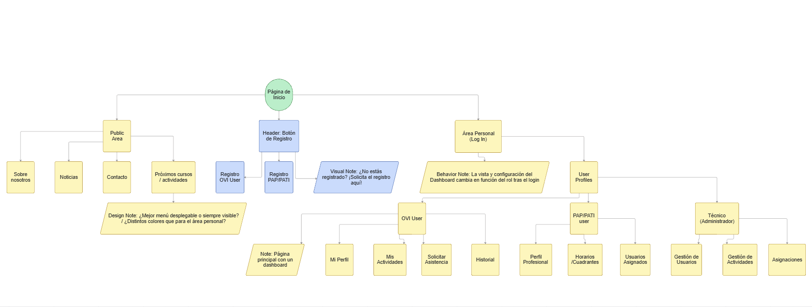

# SgOVI_ei102725avn
SgOVI - Sistema de Gestión de Oficina de Vida Independiente. Proyecto académico diseñado para administrar usuarios con diversidad funcional, gestionar el catálogo de actividades sociales y coordinar a los profesionales de asistencia personal (PAP/PATI).

Enlaces de interés:
- https://ovicastello.org/
- https://docs.google.com/forms/d/e/1FAIpQLSelYRAnQE9fS0C3xpDTZJlK2HaI8BtbXQ1x3g4GEI60EKAYrQ/viewform

## Instrucciones de acceso a la BBDD
Para el acceso a la base de datos de db-aules usamos el siguiente comando →  psql -h db-aules.uji.es -U ei102725avn ei102725avn

El nombre del grupo es →  ei102725avn
La contraseña para el acceso a la base de datos es → vivaMessi1010

      - Administrador --> admin0 (1234)
      - Usuario OVI --> juan.perez (1234)
      - PAP/PATI --> 

## Lo que debe hacer la aplicación
Gestión de Ovi Users --> El sistema tiene que posibilitar el alta y la modificación de datos personales y de contacto de cada ovi User, incluyendo el registro explícito del consentimiento informado según la normativa LOPD/RGPD. Como el registro de Ovi Users requiere una aceptación por parte del técnico responsable para poder tener acceso, la idea es que en el formulario de registro metamos una sección en la que el usuario nos indique el nombre de usuario y la contraseña que quiere usar para loggear. Nosotros meteremos esos datos en la tabla CREDENTIALS de nuestra BBDD pero en un principio la casilla de "activada" estará en false, indicando que la cuenta aún no ha sido activada. En este momento el usuario en cuestión solo podrá loggear para ver el estado de la activación de su cuenta. El técnico OVI por su parte, tendrá una opción que será validar usuarios, en la que podrá ver los distintos usuarios y cuando lo decida activar la cuenta del usuario que desee, marcando la casilla de activated a True. A partir de este momento, cuenta activada, cuando el usuario entre con sus credenciales podrá ver el menú completo con sus opciones correspondientes.

      - Usuario creado con esta funcionalidad: LeoMessi (patata)

Gestión de candidatos a PAP o PATI --> Cualquier persona interesada puede trabajar como asistente personal registrandose en la aplicación como PAP/PATI. Los datos a registrar se definirán en base a los formularios actuales que tiene la OVI. Al igual que pasaba con los OVI Users, aquí el pap/pati tendrá que poner sus credenciales en el formulario de registro pero su cuenta estará desactivada en un principio, por lo que solo podrá entrar para ver la activación de esa cuenta. El técnico OVI tendrá otra opción para validar Pap/Patis y será el que activará la cuenta de ese pap/pati y a partir de este momento ya podrá acceder a la sección "Mi portal" y ver todas las opciones que tiene. 

      - Usuario creado con esta funcionalidad: edgar.adell (patata)

Solicitudes de Asistencia Personal --> Las personas usuarias de la OVI deben poder registrar una petición de asistencia personal y seguir el estado de la misma (en revisión, aprobada, cerrada con contrato, cerrada con contrato finalizado o rechazada). La asignación se hará por parte del técnico directamente, es decir, lo hará este de forma manual a través de una opción que tendrá para ello en la sección "Mi portal". Si se llega a un acuerdo definitivo, se firmará un contrato, por lo que la aplicación debe guardar los datos de inicio y final de contrato, y el documento PDF del contrato definitivo. (Esto último preguntarle en clase). 

Actividades de formación y divulgación --> El técnico OVI será el encargado de gestionar la creación de las distintas actividades. Esta gestión incluirá la creación de las actividades, la asignación de los instructores que impartan la actividad. Habrán dos tipos de actividades: actividades de formación con un número limitado de participantes, y luego actividades de divulgación en las que no se requerirá inscripción, pero también estará disponible. En el caso de las actividades de formación, la aplicación deberá proporcionar un proceso de inscripción a esa actividades con los datos personales de la persona que participe. Y una vez acabe la formación, el instructor definido deberá poder registrar la asistencia de cada participante a la actividad, para que luego la aplicación pueda emitir a esos asistentes un certificado de asistencia en formato PDF. En las actividades de divulgación, el aforo se controlará in situ, será el instructor el que compruebe la asistencia de los participantes inscritos y también el que registrará el nombre de las personas participantes, la aplicación debe permitir esto.

## Diseño del SiteMap
A continuación se muestra el SiteMap del proyecto que sirve como guia para el flujo y diseño de la experiencia de usuario en nuestro sistema de información:

A CORREGIR --> Está bien, pero falta funcionalidad.
P.e. el PAP/PATI dónde puede ver el contrato, el OVIuser dónde puede enviar un mensaje, o registrar un contrato...
Del técnico OVI, lo mismo: dónde acepta/rechaza la petición de un candidato a PAP/PATI, dónde acepta una solicitud de asistencia personal...

## Diseño Conceptual (Diagrama UML)
A continuación se muestra el diagrama de clases UML que sirve como punto de partida para el diseño de nuestro sistema de información:

### Cambios realizados sobre el diseño
- Cambios sobre atributos
- Contract ahora está relacionada únicamente con Negotiation
- Assistance Request puede tener 1 o muchos Resquest Schedule, igual que PAP/PATI con SCHEDULE

