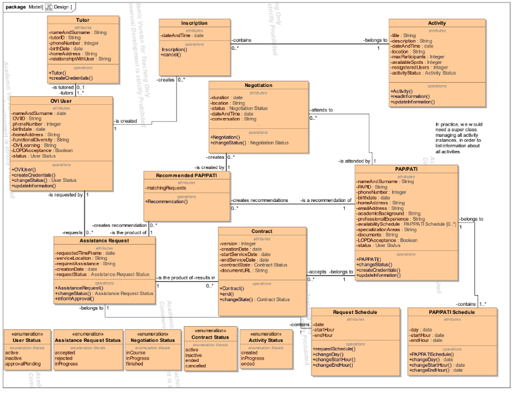

# SgOVI_ei102725avn
SgOVI - Sistema de Gestión de Oficina de Vida Independiente. Proyecto académico diseñado para administrar usuarios con diversidad funcional, gestionar el catálogo de actividades sociales y coordinar a los profesionales de asistencia personal (PAP/PATI).

## Diseño Conceptual (Diagrama UML)
A continuación se muestra el diagrama de clases UML que sirve como punto de partida para el diseño de nuestro sistema de información:

